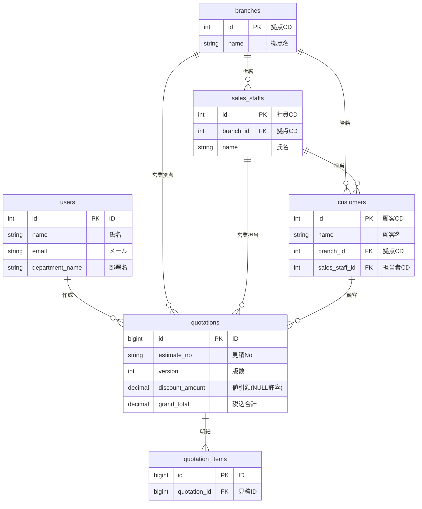

# データベース設計書

- **Database Name:** `saywell_quotation_db`
- **Character Set:** `utf8mb4`
- **更新日:** 2026 年 1 月 15 日

## 1. ER 図 (Entity Relationship)

## 2. テーブル定義詳細

### branches (営業所マスタ)

全拠点の情報を管理。

| カラム名   | 型           | 制約        | 説明              |
| :--------- | :----------- | :---------- | :---------------- |
| **id**     | INT          | PK          | 拠点コード (4 桁) |
| name       | VARCHAR(50)  | NOT NULL    | 営業所名          |
| sort_no    | INT          | DEFAULT 0   | 表示順            |
| address    | VARCHAR(200) |             | 住所              |
| phone      | VARCHAR(20)  |             | 電話番号          |
| created_at | DATETIME     | DEFAULT NOW | 作成日時          |
| updated_at | DATETIME     | DEFAULT NOW | 更新日時          |

### users (システム利用者マスタ)

見積作成システムを利用する事務担当者（メディカル担当など）。

| カラム名        | 型           | 制約        | 説明                            |
| :-------------- | :----------- | :---------- | :------------------------------ |
| **id**          | INT          | PK, AI      | システム ID                     |
| name            | VARCHAR(50)  | NOT NULL    | 利用者名                        |
| email           | VARCHAR(100) | UNIQUE      | メールアドレス (ログイン ID)    |
| password_hash   | VARCHAR(255) | NOT NULL    | パスワードハッシュ (SHA-256 等) |
| department_code | VARCHAR(20)  |             | 所属部署コード                  |
| department_name | VARCHAR(100) |             | 所属部署名                      |
| created_at      | DATETIME     | DEFAULT NOW | 作成日時                        |
| updated_at      | DATETIME     | DEFAULT NOW | 更新日時                        |

### sales_staffs (営業担当者マスタ)

各拠点の営業マン。顧客の担当者として紐づく。

| カラム名   | 型          | 制約               | 説明              |
| :--------- | :---------- | :----------------- | :---------------- |
| **id**     | INT         | PK                 | 社員コード (8 桁) |
| branch_id  | INT         | FK -> branches(id) | 所属営業所 ID     |
| name       | VARCHAR(50) | NOT NULL           | 担当者名          |
| created_at | DATETIME    | DEFAULT NOW        | 作成日時          |
| updated_at | DATETIME    | DEFAULT NOW        | 更新日時          |

### customers (得意先マスタ)

見積の宛先となる顧客情報。

| カラム名       | 型           | 制約                   | 説明                 |
| :------------- | :----------- | :--------------------- | :------------------- |
| **id**         | INT          | PK                     | 顧客コード (8 桁)    |
| name           | VARCHAR(100) | NOT NULL               | 顧客名（病院名など） |
| kana           | VARCHAR(100) |                        | 検索用フリガナ       |
| branch_id      | INT          | FK -> branches(id)     | 管轄営業所 ID        |
| sales_staff_id | INT          | FK -> sales_staffs(id) | 担当営業 ID          |
| address        | VARCHAR(200) | NULL                   | 住所                 |
| created_at     | DATETIME     | DEFAULT NOW            | 作成日時             |
| updated_at     | DATETIME     | DEFAULT NOW            | 更新日時             |

### quotations (見積ヘッダー)

見積書の基本情報。

| カラム名             | 型                | 制約                   | 説明                            |
| :------------------- | :---------------- | :--------------------- | :------------------------------ |
| **id**               | BIGINT            | PK, AI                 | システム ID                     |
| estimate_no          | VARCHAR(50)       | NOT NULL               | 見積番号 (Q-yyyyMMddHHmmss-RRR) |
| version              | INT               | DEFAULT 1              | 版数 (未使用/予備)              |
| is_submitted         | BOOLEAN           | DEFAULT FALSE          | 提出済フラグ                    |
| created_by_user_id   | INT               | FK -> users(id)        | 作成者 (事務担当)               |
| user_department_name | VARCHAR(100)      |                        | 作成時点の部署名（履歴用）      |
| sales_branch_id      | INT               | FK -> branches(id)     | 担当営業所                      |
| sales_staff_id       | INT               | FK -> sales_staffs(id) | 担当営業マン                    |
| customer_id          | INT               | FK -> customers(id)    | 顧客 ID (手入力時は NULL)       |
| customer_name        | VARCHAR(100)      | NOT NULL               | 顧客名（スナップショット）      |
| project_name         | VARCHAR(200)      |                        | 件名・案件名                    |
| total_amount         | DECIMAL(19,2)     | DEFAULT 0              | 税抜小計                        |
| **discount_amount**  | **DECIMAL(19,2)** | **NULL**               | **値引き額 (NULL 許容)**        |
| total_cost           | DECIMAL(19,2)     | DEFAULT 0              | 原価合計                        |
| total_profit         | DECIMAL(19,2)     | DEFAULT 0              | 粗利金額                        |
| profit_rate          | DECIMAL(5,2)      | DEFAULT 0              | 粗利率 (%)                      |
| grand_total          | DECIMAL(19,2)     | DEFAULT 0              | 見積合計金額 (税込)             |
| issue_date           | DATE              |                        | 発行日                          |
| remarks              | TEXT              |                        | 備考                            |
| attached_file_path   | VARCHAR(500)      |                        | 添付ファイルパス                |
| created_at           | DATETIME          | DEFAULT NOW            | 作成日時                        |
| updated_at           | DATETIME          | DEFAULT NOW            | 更新日時                        |

### quotation_items (見積明細)

見積の内訳明細。

| カラム名     | 型            | 制約                 | 説明                              |
| :----------- | :------------ | :------------------- | :-------------------------------- |
| **id**       | BIGINT        | PK, AI               | 明細 ID                           |
| quotation_id | BIGINT        | FK -> quotations(id) | 見積ヘッダー ID                   |
| row_order    | INT           | NOT NULL             | 表示順                            |
| row_type     | VARCHAR(20)   | 'normal'             | 行タイプ (明細, 小計, コメント等) |
| item_code    | VARCHAR(50)   |                      | 商品コード                        |
| item_name    | VARCHAR(255)  |                      | 商品名・摘要                      |
| manufacturer | VARCHAR(100)  |                      | メーカー名                        |
| quantity     | DECIMAL(10,2) | DEFAULT 0            | 数量                              |
| cost_price   | DECIMAL(12,0) | DEFAULT 0            | 仕切単価 (原価)                   |
| unit_price   | DECIMAL(12,0) | DEFAULT 0            | 提出単価 (売価)                   |
